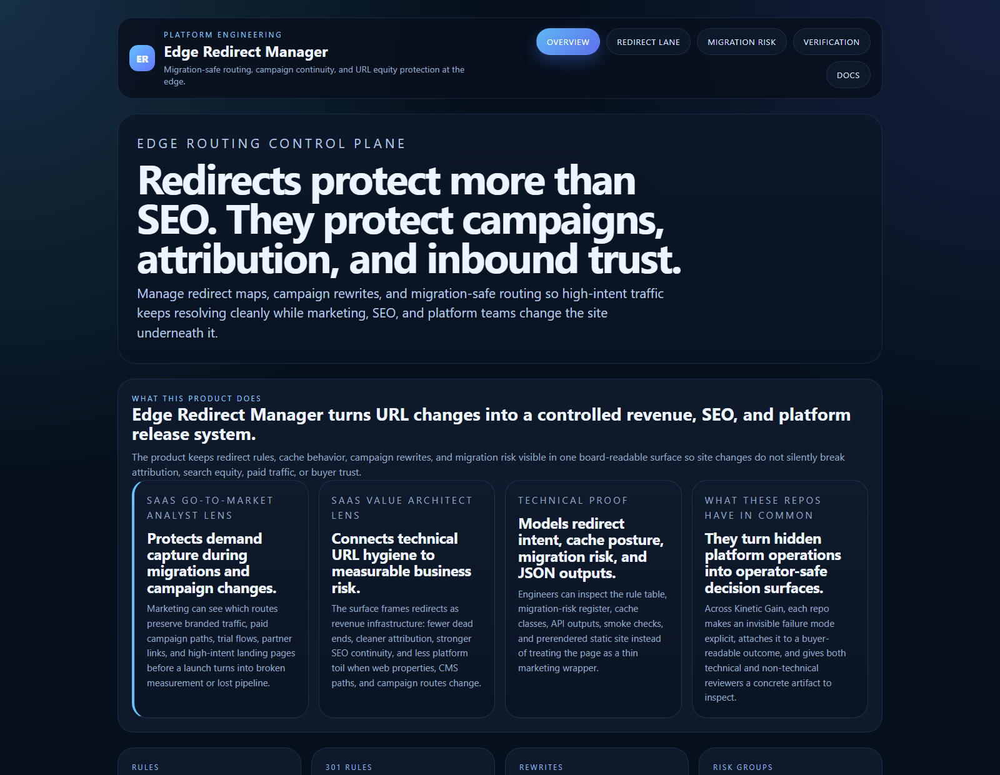
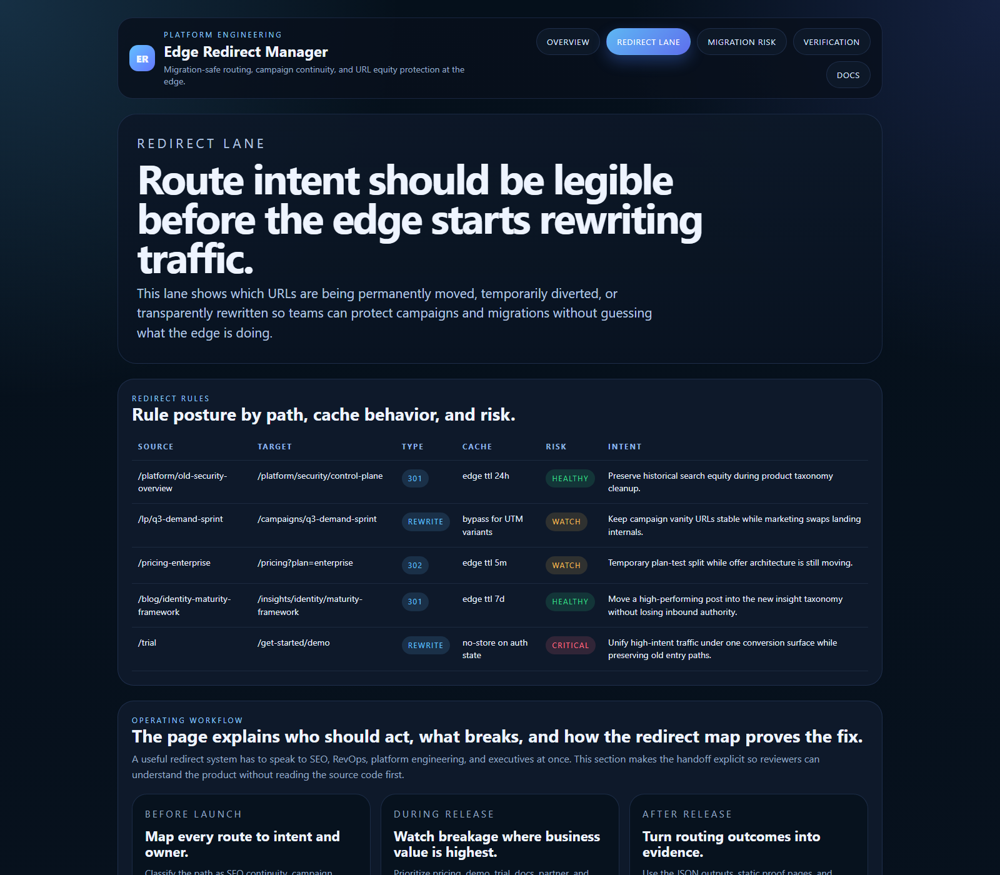
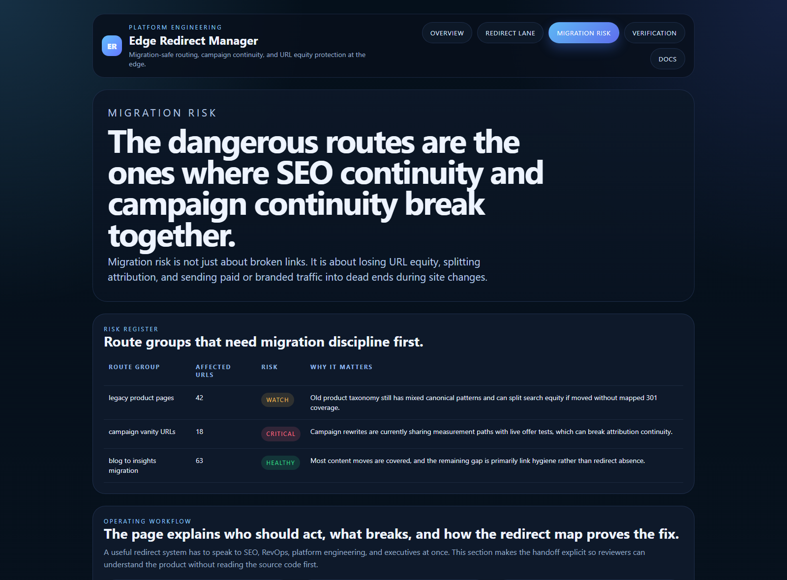
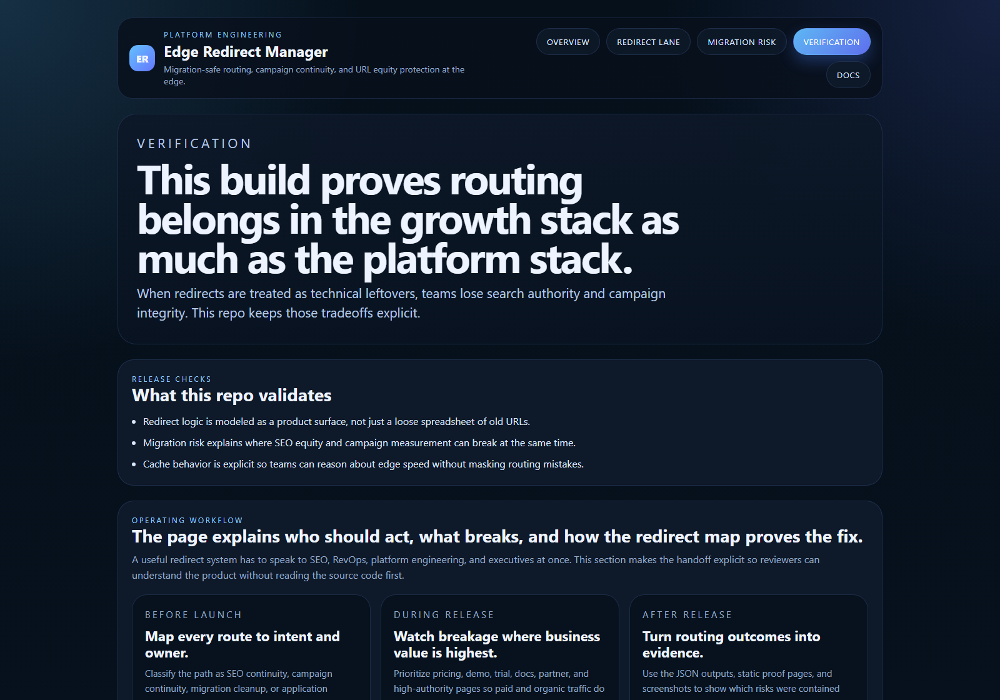

# Edge Redirect Manager

Board-ready Kinetic Gain surface for large redirect maps, edge rewrites, campaign continuity, and migration-safe URL behavior.

- Live: [http://redirects.kineticgain.com/](http://redirects.kineticgain.com/)
- Repo: [https://github.com/mizcausevic-dev/edge-redirect-manager](https://github.com/mizcausevic-dev/edge-redirect-manager)

## Why this exists

Redirect work looks technical until it breaks revenue:
- search equity gets split during migrations
- campaign vanity URLs stop mapping cleanly to live landing pages
- paid traffic lands on stale or mismatched routes
- attribution continuity breaks because rewrites and redirects are handled ad hoc

`edge-redirect-manager` treats edge routing as a growth and platform concern at the same time. It keeps redirect intent, cache behavior, and migration risk visible in one place.

## What this product does

Edge Redirect Manager turns URL changes into a controlled revenue, SEO, and platform release system. It keeps redirect maps, cache behavior, campaign rewrites, and migration risk visible in one board-readable surface so site changes do not silently break attribution, search equity, paid traffic, or buyer trust.

- **SaaS go-to-market analyst view:** protects demand capture during migrations and campaign changes by showing which routes preserve branded traffic, paid paths, trial flows, partner links, and high-intent landing pages.
- **SaaS value architect view:** connects technical URL hygiene to measurable business risk: fewer dead ends, cleaner attribution, stronger SEO continuity, and less platform toil when CMS paths and campaign routes change.
- **Technical buyer view:** models redirect intent, cache posture, migration risk, JSON outputs, smoke checks, prerendered static pages, and edge-worker artifacts so the proof is inspectable.
- **Executive narrative:** frames redirects as operating infrastructure. A routing mistake can become lost pipeline, distorted campaign reporting, support load, and weaker confidence in the site estate.

## What these repos have in common

This repo follows the broader Kinetic Gain pattern: turn hidden platform operations into operator-safe decision surfaces. Each surface names the risk, maps the owner and control plane, exposes JSON and static proof, and gives commercial leaders and technical reviewers a shared artifact to inspect.

## Operating workflow

- **Before launch:** map each route to intent, business owner, cache posture, and risk class.
- **During release:** watch breakage where business value is highest: pricing, demo, trial, docs, partner, and high-authority pages.
- **After release:** turn routing outcomes into evidence using JSON outputs, static proof pages, screenshots, and verification checks.

## What it includes

- TypeScript control plane for redirect maps, rewrites, cache policy, and migration-safe routing
- synthetic redirect lane covering campaign vanity URLs, SEO continuity, and large route migrations
- reusable outputs for rule risk, cache posture, and migration breakage exposure
- prerendered static site, JSON payloads, screenshots, docs, and edge-worker artifacts

## Routes

- `/`
- `/redirect-lane`
- `/migration-risk`
- `/verification`
- `/docs`

## API

- `/api/dashboard/summary`
- `/api/redirect-lane`
- `/api/cache-rules`
- `/api/migration-risk`
- `/api/verification`
- `/api/sample`

## Screenshots






## Local Development

```powershell
cd edge-redirect-manager
npm install
npm run dev
```

Open:
- [http://127.0.0.1:5286/](http://127.0.0.1:5286/)
- [http://127.0.0.1:5286/redirect-lane](http://127.0.0.1:5286/redirect-lane)
- [http://127.0.0.1:5286/migration-risk](http://127.0.0.1:5286/migration-risk)
- [http://127.0.0.1:5286/verification](http://127.0.0.1:5286/verification)
- [http://127.0.0.1:5286/docs](http://127.0.0.1:5286/docs)

## Validation

- `npm run verify`
- `npm run prerender`
- `npm run render:assets`

## Edge Assets

- [workers/edge-worker.ts](./workers/edge-worker.ts)
- [kv/redirect-map.json](./kv/redirect-map.json)

## Docs

- [Architecture](./docs/architecture.md)
- [Origin](./docs/ORIGIN.md)
- [Changelog](./CHANGELOG.md)
